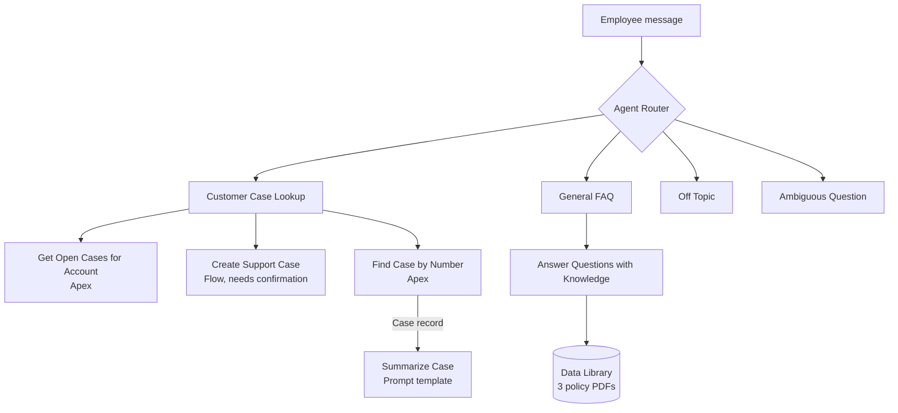

# Agentforce Insurance Service Agent

An Agentforce employee agent for a made-up insurance company, Bluebonnet Mutual. Employees can ask it about customer cases, create new cases, get a case summary with a draft reply, and ask policy questions that it answers from company documents.

I built this in a Developer Edition org to learn Agentforce end to end: Agentforce Builder (Agent Script), Apex and Flow actions, Prompt Builder, and a Data Library on Data Cloud.

All company names, policies and data are fictional.

## What it does

| Example question | What happens |
|---|---|
| What open cases does Acme have? | Apex action returns the account's open cases |
| Create a high priority case for Globex about a billing error | Flow creates the case after the user confirms |
| Summarize case 00001027 and draft a reply | Apex finds the case, then a prompt template writes the summary and reply |
| I cancelled 20 days after buying, do I get everything back? | Answer comes from the policy PDFs, with the source cited |
| What's the weather? | Off-topic subagent redirects the user |

## How it's put together



| Piece | Name | Notes |
|---|---|---|
| Agent | `Case_lookup_Agent` | 4 subagents, router picks one per message |
| Apex | `AgentCaseLookup` | Open cases by account name, max 10 per account |
| Apex | `AgentFindCase` | Finds a case by number and returns the record for the prompt template |
| Apex tests | `AgentCaseLookupTest`, `AgentFindCaseTest`, `AgentTestDataFactory` | 14 tests |
| Flow | `Agen_Create_Case` | Checks the account exists before creating the case |
| Prompt template | `Summarize_Case` | Flex template grounded on Case fields |
| Knowledge | Data Library | PDFs in `data/policies` |
| Permissions | `Case_Lookup_Agent_User` | Apex access, Account/Case read, Case create |

## Design choices

- Apex and Flow do the actual data work. The LLM only picks the action, pulls the inputs out of the message and writes text. Anything that is a fact (case numbers, amounts) comes from code, not from the model.
- Queries run `WITH USER_MODE`, so the agent can only see what the user can see.
- Every action returns a clear "not found" message instead of an empty result. With an empty result the agent tends to make something up.
- Both Apex actions run one query per batch. `AgentCaseLookup` uses a parent-child subquery so each account gets its own 10-case limit.
- Only the create action asks for confirmation. Read-only actions don't.
- The FAQ subagent is told to answer only from the documents, give the phone number when it doesn't know, and never offer things the agent can't do.

## Testing

Apex tests (14):

| Class | Coverage |
|---|---|
| `AgentCaseLookup` | 96% |
| `AgentFindCase` | 100% |

Besides the normal cases, the tests check that each action uses a single query no matter how many requests come in, that one account with lots of open cases doesn't push other accounts out of the results, that a user without Case access gets blocked instead of seeing data, and that blank or unknown inputs return a clear message.

I also tested the agent itself with 22 conversations, each in a fresh session, checking the trace for which subagent and action ran and what inputs were passed. For case creation I checked the actual records. The tests covered:

- case lookup: account with cases, no account name given, account with only closed cases
- case creation: confirm, decline, unknown account, invalid priority
- chaining: summarize by number, unknown case number, "summarize the high priority one" after listing cases
- knowledge: deductibles, cancellation refund (needs two rules combined), question not in the docs, product not offered
- guardrails: off-topic question, prompt injection attempt, vague request
- security: restricted user on the Lightning page

## Problems I ran into

| Problem | Cause | Fix |
|---|---|---|
| Case questions went to General FAQ and failed | Builder changes weren't saved, so the router didn't know about the new subagent | Saved, checked the router, retested in a new session |
| Creating a case for an account that doesn't exist created a case with no account | The Flow decision sent "not found" down the create path | Fixed the decision and checked it with Flow debug in rollback mode |
| The agent could fill in the Flow's result message itself | The output variable was also marked as input | Made it output only and re-added the action, since the action keeps the old variable list |
| Case summary ignored the description | The prompt template had placeholder text instead of the merge field | Re-inserted the merge field and checked the resolved prompt |
| Draft reply sounded like the company agreed with the customer's claim | No rule about it | Added a rule to describe claims as what the customer reported |
| A question about a product we don't sell went to Off Topic with a generic "Salesforce" answer | FAQ description was too narrow and the off-topic message was vague | Widened the FAQ description and rewrote the off-topic instruction |
| Agent offered to transfer to a live agent | It can't do that, the model made it up | Added an instruction to give the phone number instead |
| After I bulkified `AgentCaseLookup`, one busy account could use up the whole query limit and other accounts showed "no open cases" | One shared row limit for the whole batch | Switched to a subquery so each account has its own limit, and added a test for it |

Known issues:

- Twice the first message in a session got a blank response. Sending it again worked. I haven't found the cause yet.
- `AgentCaseLookup` reads at most 1,000 matching accounts per batch. The agent calls it one account at a time so this doesn't come up in practice.
- The Data Library files don't deploy with the metadata. They have to be uploaded in each org.

## Setup

You need an org with Agentforce and Data Cloud (a new Agentforce Developer Edition org has both) and the Salesforce CLI.

```bash
sf org login web --alias agentDE --set-default

sf project deploy start --manifest manifest/package.xml --target-org agentDE

sf apex run test --class-names AgentCaseLookupTest --class-names AgentFindCaseTest \
  --code-coverage --result-format human --wait 10 --target-org agentDE

sf apex run --file scripts/apex/seed-data.apex --target-org agentDE
```

Then in the org:

1. Turn on Data Cloud in Data Cloud Setup and assign yourself Data Cloud Admin.
2. Create a Data Library in the agent and upload the PDFs from `data/policies`. Wait until indexing is done.
3. Assign `Case_Lookup_Agent_User` and Prompt Template User.
4. Open the agent in Agentforce Builder, commit the version and activate it.

## Project structure

```
force-app/main/default/
  aiAuthoringBundles/     Agent Script
  bots/
  genAiPlannerBundles/
  classes/                Apex actions and tests
  flows/
  genAiPromptTemplates/
  permissionsets/
data/policies/            Policy PDFs
scripts/apex/             Seed data
manifest/package.xml
```